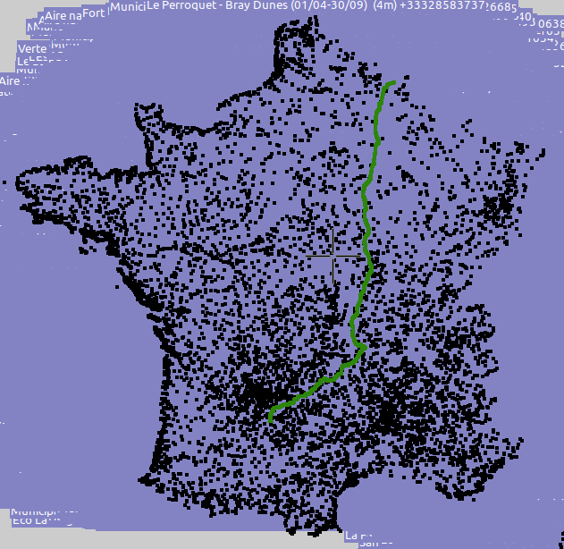
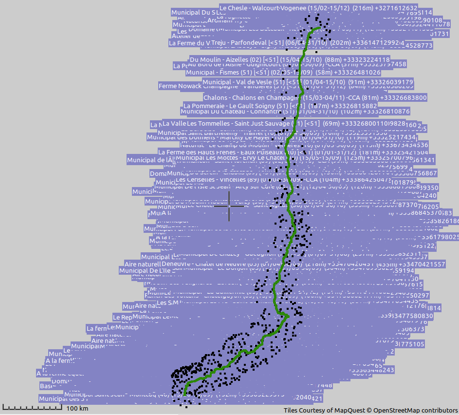

# Camping selector

When travelling by bicycle I use a simple Garmin Etrex 20x for my navigation. Mostly because of it's battery usage (with 2 rechargable AA's you can ride about 400km) and simplicity (a line on a map is enough for me).

My routes I create with [Brouter](http://brouter.de/brouter-web/), and for campsite searching I use [Archies Campings](http://www.archiescampings.eu/) where you can download GPX files with camping-waypoints per country.

In an ideal world, I put to GPX with my trip, together with a GPX with waypoints on my Garmin device. When I want to start looking for a camping, I zoom out on my Garmin and it will show the camping waypoints in the neighbourhood as flag.

The problem is, in some countries, like France there are a lot of campings. 

| 
|:--:| 
| *All the campings of France and one route.* |

Putting a file with all the 9000 campsites of France on a Garmin slows the device down, and more problematic my simple Garmin doesn't load more then 10.000 lines per GPX file. Also, most of the waypoints are of no use.

The solution? This script which will allow to select only the waypoints near the route!

## Dependencies

You need to run this in a Python 3 environmnent and there is only one dependency: [geopy](https://pypi.org/project/geopy/). Install it with `pip install geopy`.

## Usage

In it's most simplest form, execute the script like this:

```
python camping_selector.py camping_waypoints.gpx your_route.gpx 20 selection_of_campings.gpx
```

- **camping_waypoints.gpx**: A file, with camping waypoints
- **your_route.gpx**: The route you will be following during your travels
- **20**: The number of kilometers around your route where you want to look for campings. This is an generous approximation.
- **selection_of_campings.gpx**: A file with the waypoints 20km around your route. Note that your route is nót included in this file!

| 
|:--:| 
| *Only the campings near the route.* |


However, there are more possibilities

```
python camping_selector.py campings_france.gpx,campings_germany.gpx, your_route_part1.gpx,your_route_part2.gpx,your_route_part3.gpx 20 selection_of_campings.gpx 300
```

- **campings_france.gpx,campings_germany.gpx**: Files separated with a comma (without space), with camping waypoints
- **your_route_part1.gpx,your_route_part2.gpx,your_route_part3.gpx**: The routes you will be following during your travels, separated with a comma without spaces
- **20**: The number of kilometers around your route where you want to look for campings
- **selection_of_campings.gpx**: A file with the waypoints 20km around your route. Note that your route is nót included in this file!
